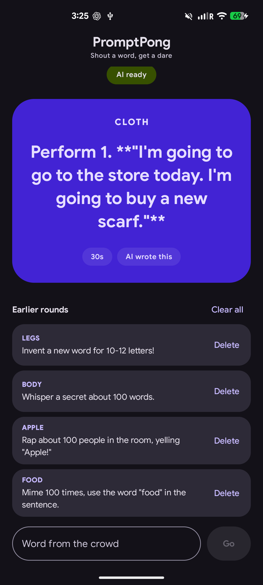

<div align="center">

# PromptPong

**Shout a word. Get a dare. All of it written on your phone.**

[](https://kotlinlang.org)
[](https://www.jetbrains.com/lp/compose-multiplatform/)
[](#requirements)
[](#requirements)
[](#requirements)
[](#how-the-ai-works)
[](#license)



</div>

---

## What it is

A party game for a room full of people. Someone shouts a word, the host types it
in, and the app writes a short silly dare about that word.

Every dare is generated on the device. There is no server, no account and no
network call at play time.

## How the AI works

Each platform uses the best local option available to it, behind one shared
interface, so the game code never knows which one is running.

| Platform | Engine | Model | Setup |
| --- | --- | --- | --- |
| Android | ONNX Runtime GenAI | Gemma 3 270M | one time model download |
| iOS | Apple Foundation Models | Apple's system model | none, built into iOS |

On Android the model arrives as a single zip, unpacks into app private storage
and runs offline from then on. ONNX Runtime allocates natively, so model size is
limited by device memory rather than by the Java heap.

On iOS there is nothing to download because Apple Intelligence is part of the
system.

If the model is missing, unsupported or slow to answer, the app falls back to a
built in list of dares so the game never stalls. The card tells you which one you
got: **AI wrote this** or **built-in dare**.

## Requirements

**Android**

- API 24 or higher
- About 400 MB free space for the model
- Network access for the first launch only

**iOS**

- iOS 26 or later, on a device that supports Apple Intelligence, with the feature
  switched on in Settings
- Apple Intelligence does not exist in the Simulator, so the Simulator always
  plays with built in dares

## Getting started

**1. Clone**

```shell
git clone https://github.com/Rohit-554/PromptPong.git
cd PromptPong
```

**2. Point Gradle at your Android SDK**

Create `local.properties` in the project root:

```properties
sdk.dir=/Users/you/Library/Android/sdk
```

**3. Run it**

Android, with a device or emulator connected:

```shell
./gradlew :androidApp:installDebug
```

iOS, from Xcode:

```shell
open iosApp/iosApp.xcodeproj
```

Set your `TEAM_ID` in `iosApp/Configuration/Config.xcconfig` before running on a
real device.

**4. Turn on the AI**

On first launch Android shows a **Download** button. That fetches the model once,
after which the app works with no network at all. You can also tap **Not now** and
play with the built in dares.

## Development

```shell
./gradlew :shared:testAndroidHostTest     # unit tests
./gradlew :androidApp:assembleDebug       # build the APK
./gradlew :shared:compileKotlinIosArm64   # compile the iOS framework
```

## Project structure

```
shared/
  commonMain/     domain, generators, prompt building, UI, theme
  androidMain/    ONNX Runtime engine, model download and unpacking
  iosMain/        Apple Intelligence engine and the Kotlin side of the bridge
androidApp/       thin Android host
iosApp/           thin SwiftUI host and the Swift side of the bridge
```

The one rule worth keeping: nothing from either AI runtime is allowed above the
`LocalAiEngine` interface. That is what lets a single ViewModel drive two
completely different backends.

`CLAUDE.md` documents the parts that are easy to get wrong, including the custom
Ivy repository the ONNX GenAI AAR comes from and how the Kotlin to Swift bridge
reaches Apple Intelligence.

## Notes on model quality

Gemma 3 270M is a very small model, so its dares are playful rather than sharp,
and it sometimes wanders off the word. Two things keep it usable:

- The model's chat template is applied, without which an instruction tuned model
  drops into plain text continuation and simply copies its prompt.
- Each answer is forced to start with one of 32 opening verbs, so the model
  continues an instruction that is already underway instead of replying with
  "Here's a party game idea".

Swapping in a larger model means changing the constants in `ModelSpec` and
pointing at a different zip. No code changes are needed.

## Credits

- [Gemma 3](https://huggingface.co/google/gemma-3-270m) by Google, Gemma Terms of
  Use
- [ONNX Runtime GenAI](https://github.com/microsoft/onnxruntime-genai) by
  Microsoft, MIT
- The Android model bundle is the one published for
  [MindKit](https://github.com/Rohit-554/MindKit)

## License

MIT
